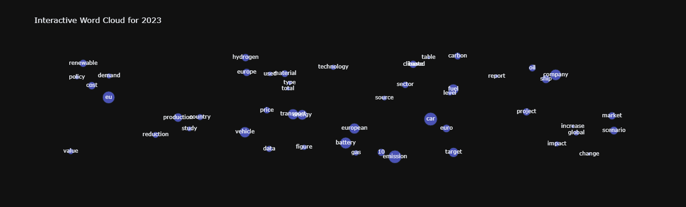

# T&E Publication Database

## Overview
This repository contains a comprehensive collection of T&E (Transport & Environment) publications found at [T&E Articles](https://www.transportenvironment.org/articles), including Clean Cities Campaign (CCC) posts. Find the link to the Google Drive with the dataset [here](https://drive.google.com/drive/folders/1OduxzrbnPXHJuOGh3lt-79uPJn3fiAKZ).



## How to Update the Database

Run the five scripts in order:

```bash
python 1_download.py       # scrape article pages + download PDFs to disk
python 2_parse.py          # extract raw text from HTML + PDFs → docs_raw.parquet
python 3_filter.py         # clean text, filter low-quality docs, deduplicate → docs_filtered.parquet
python 4_embed.py          # embed text chunks into FAISS index
python 5_build_parquet.py  # build output parquet files for the web app
```

Steps 2–5 can be re-run independently without re-downloading anything.
Step 3 onwards can be re-run without re-parsing source files — useful when tuning cleaning or filter rules.

---

## Repository Structure

```
config.py            — all configuration: sources, paths, model settings
utils.py             — shared helper functions

1_download.py        — scrape TE + CCC, download HTML + PDF files to disk
2_parse.py           — extract raw text from saved files, write docs_raw.parquet
3_filter.py          — clean text, filter low-quality + duplicate docs, write docs_filtered.parquet
4_embed.py           — embed text chunks into FAISS index
5_build_parquet.py   — build output parquet files for the web app

data/
  france/
    html/            — downloaded article HTML pages
    pdf/             — downloaded PDF files
  brussels/
    html/
    pdf/
  germany/
    html/
    pdf/
  ccc/
    html/            — saved WordPress post HTML content
    pdf/

output/
  articles.csv                              — article metadata (title, date, type, URL, …)
  docs_raw.parquet                          — raw extracted text per document (no cleaning applied)
  docs_filtered.parquet                     — cleaned + filtered fulltext per document
  article_docs.csv                          — article ↔ document mapping
  filter_log.csv                            — per-doc drop reasons from step 3
  multilingual-e5-small-docs.index         — FAISS vector index
  multilingual-e5-small-faiss_mapping.csv  — vector ID → doc ID mapping
  multilingual-e5-small-faiss_mapping.parquet
  metadata_with_fulltext.parquet           — joined metadata + fulltext for the web app
```

---

## Pipeline Details

### `1_download.py` — Download
- Creates a timestamped backup of the `output/` folder before running.
- Paginates TE article list pages (France, Brussels, Germany) and the CCC WordPress REST API.
- Skips articles already present in `articles.csv` (incremental).
- Saves each article page as `.html` under `data/{office}/html/`.
- Downloads all linked PDFs (filtered to allowed domains) to `data/{office}/pdf/`.
- Writes article metadata rows to `articles.csv`.

### `2_parse.py` — Parse
- Reads each article's saved HTML file.
- Stores the **raw HTML** for each article and the **raw extracted text** from each linked PDF — no cleaning or normalisation applied.
- PDF links are discovered by parsing each HTML file; PDFs are loaded with `PDFMinerLoader` → `PyPDFLoader` → `PDFPlumberLoader` (fallback chain).
- Writes raw text to `docs_raw.parquet` and article↔doc mappings to `article_docs.csv`.
- Skips docs already in `docs_raw.parquet` (incremental by `Source URL`).

### `3_filter.py` — Clean & Filter
- Reads `docs_raw.parquet` and applies cleaning then quality filtering in sequence.
- **Cleaning** (`apply_cleaning`): HTML docs are parsed to plain text (`html_to_plain`); PDFs have repeated sentences removed (`dedup_sentences`); all docs then go through `clean_text` (URL removal, boilerplate stripping, digit-run removal, etc.). Text Hash and Status are computed here.
- **Quality filters** (applied in order): drops empty rows, documents shorter than `FILTER_MIN_CHARS`, PDFs with no T&E organisation keyword (`ORG_KEYWORDS`), documents with too high a symbol ratio or too low an alpha ratio.
- **Near-duplicate removal**: builds a MinHash LSH index (shingling over 5-char n-grams) and drops documents whose Jaccard similarity to an already-kept document exceeds `DEDUP_JACCARD_THRESHOLD`. When multiple near-duplicates cluster together, the best representative is chosen by source type (PDF preferred), office (Brussels > regional), then longest text.
- Writes surviving rows to `docs_filtered.parquet` and a drop log with reasons to `filter_log.csv`.
- Supports incremental mode: only processes doc IDs not already present in the existing outputs.

### `4_embed.py` — Embed
- Loads `docs_filtered.parquet`, filters rows with non-empty fulltext.
- Splits text into chunks (`RecursiveCharacterTextSplitter`, 1024 tokens, no overlap).
- Embeds each chunk with `intfloat/multilingual-e5-small`.
- Deduplicates by chunk hash and similarity threshold before adding to the index.
- Incrementally updates the FAISS `IndexFlatL2` and the mapping CSV.
- Requirements on Google Colab with T4 TPU: `pip install ftfy numpy pandas faiss-gpu-cu12 tqdm langchain-community langchain-text-splitters langchain-core sentence-transformers`

### `5_build_parquet.py` — Build Parquet
- Joins docs, articles, and the article↔doc mapping.
- Resolves duplicate article links per doc (prefers oldest date, then Brussels office).
- Writes `multilingual-e5-small-faiss_mapping.parquet` and `metadata_with_fulltext.parquet`.

---

## Key Figures
- **Last Update**: 26.08.2025
- **~4000** HTML files
- **~2000** PDF files
- **~300** dead PDF links
- **~3 GB** total size

---

## Setup

```bash
conda env create -f environment.yml
```

---

## Dependencies

| Category | Libraries |
|---|---|
| HTTP & parsing | `requests`, `beautifulsoup4`, `lxml`, `ftfy` |
| PDF processing | `pdfminer.six`, `pypdf`, `pdfplumber` (via LangChain loaders) |
| Data | `pandas`, `numpy` |
| Embeddings | `sentence-transformers`, `langchain`, `faiss-cpu` |
| Progress | `tqdm` |
